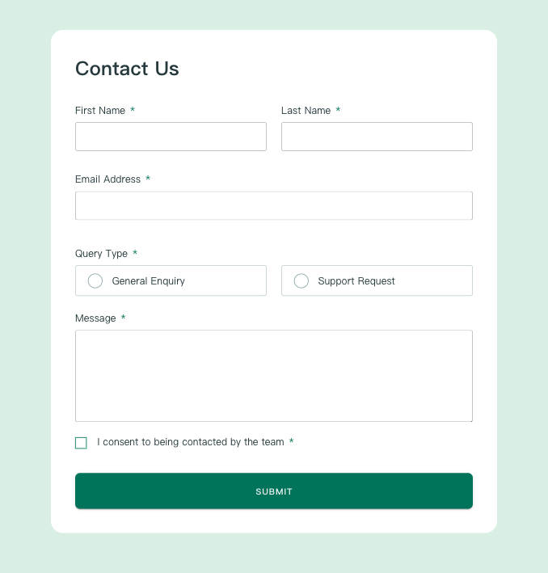

# Frontend Mentor - Contact form solution

This is a solution to the [Contact form challenge on Frontend Mentor](https://www.frontendmentor.io/challenges/contact-form--G-hYlqKJj). Frontend Mentor challenges help you improve your coding skills by building realistic projects.

## Table of contents

- [Frontend Mentor - Contact form solution](#frontend-mentor---contact-form-solution)
  - [Table of contents](#table-of-contents)
  - [Overview](#overview)
    - [The challenge](#the-challenge)
    - [Screenshot](#screenshot)
    - [Links](#links)
  - [My process](#my-process)
    - [Built with](#built-with)
    - [What I learned](#what-i-learned)
    - [Useful resources](#useful-resources)
  - [Author](#author)

## Overview

### The challenge

Users should be able to:

- Complete the form and see a success toast message upon successful submission
- Receive form validation messages if:
  - A required field has been missed
  - The email address is not formatted correctly
- Complete the form only using their keyboard
- Have inputs, error messages, and the success message announced on their screen reader
- View the optimal layout for the interface depending on their device's screen size
- See hover and focus states for all interactive elements on the page

### Screenshot

### Links

- Solution URL: [Contact-Form](https://www.frontendmentor.io/solutions/contact-form-using-vue-and-vuetify-A0gXFMgOR8)
- Live Site URL: [Contact-Form](https://kaiens-lab.github.io/Contact-Form/)

## My process

### Built with

- [Vue](https://vuejs.org/)
- [Vuetify](https://vuetifyjs.com/en/)
- CSS custom properties
- Flexbox

### What I learned

This project allowed me to review Vue lifecycle methods and form validation logic, while also gaining familiarity with basic Vuetify knowledge and custom style adjustments.

### Useful resources

- [Vuetify - Spacing](https://vuetifyjs.com/en/styles/spacing/#how-it-works)
- [Vuetify - Component](https://vuetifyjs.com/en/components/all/#containment)

## Author

- Frontend Mentor - [@kaiens-lab](https://www.frontendmentor.io/profile/kaiens-lab)
